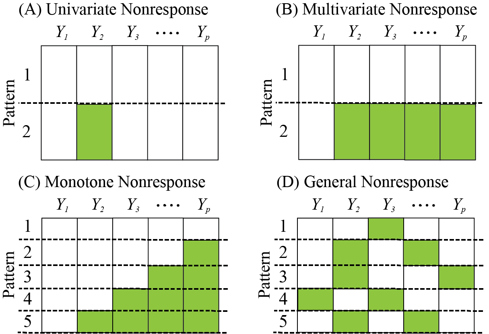
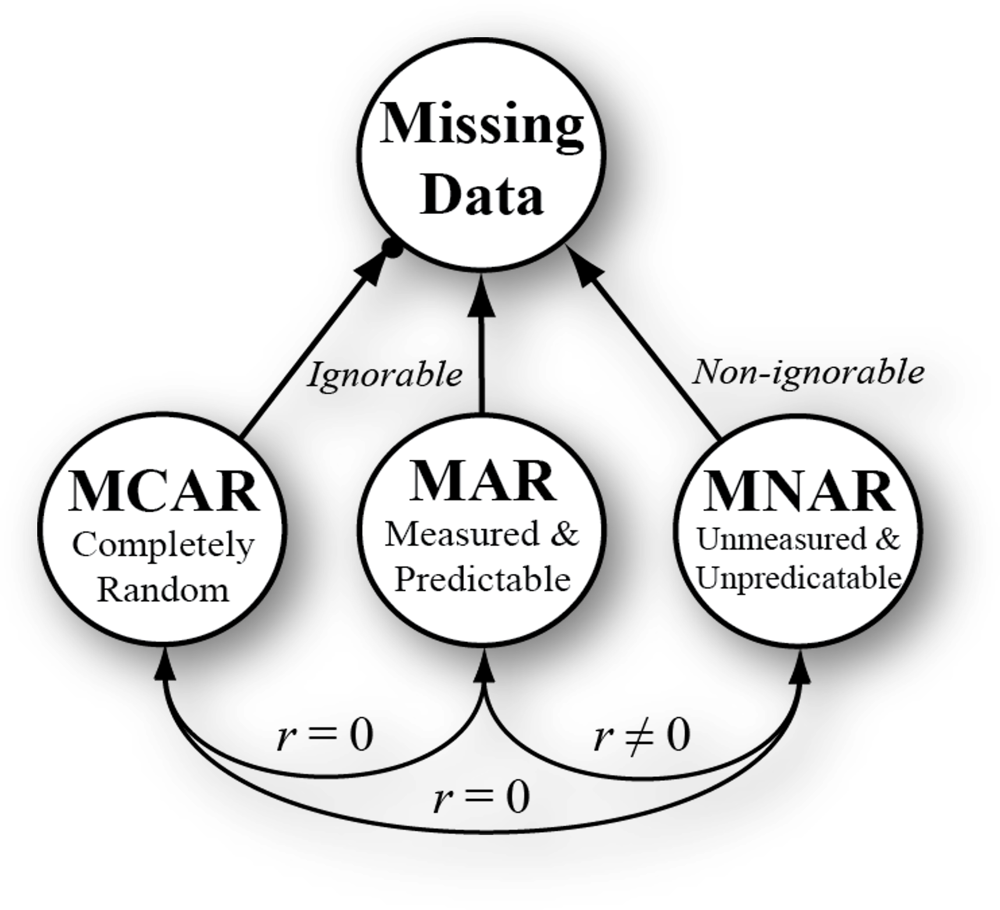

exclude: true

```{r child = "_setup.Rmd"}
```


---

#  About me

[Waylon Howard](https://wwwaylon.github.io/)

- Principal Quantitative Methodologist and Biostatistician at [*Biostatistics, Epidemiology and Analytics in Research (BEAR) Core*](https://www.seattlechildrens.org/research/resources/bear) (Seattle Children's Research Integration Hub) 

--
  - Research methods, statistics, and measurement
  - Grant writing, manuscript development, and methodological innovation
  - Training and mentoring

---

# About you

- What's your name?  
- What is your research area?  
- What are your experiences with missing data in research (and the tools used)?
- What are your expectations for this course?

---

# Preliminaries

Slides and material are available at

.center[
https://github.com/wwwaylon/mi-2024
]

- The session consists of a combination of lectures and hands-on exercises
- Feel free to ask questions anytime
- We will have frequent breaks (presentation in sections)

---

# Preliminaries

Did you have any trouble with the setup for this session?

Installing...

- [`GitHub`](https://github.com/)
- [`R`](https://www.r-project.org/) & [*RStudio*](https://www.rstudio.com/products/rstudio/)
- a `TeX` distribution (e.g., [TinyTeX](https://yihui.name/tinytex/))
- [`papaja`](https://github.com/crsh/papaja)

---

## Course schedule

.center[**Wednesday, November 20th, 2024**]

```{r schedule Wed, echo = F}
schedule <- data.frame(
  "When?" = c("12:00 - 12:30", "12:30 - 1:00", "1:00 - 1:30", "1:30 - 2:00")
  , "&nbsp;" = "&nbsp;"
  , "What?" = c("Introduction: Missing Data", "<i>Traditional Methods</i>", "MI & FIML", "<i>Auxiliary Variables</i>")
  , check.names = FALSE
)
knitr::kable(
  schedule
  , format = "html"
  , align = "ll"
  , escape = FALSE
)
```

---

# What is missing data?

```{r, what, out.width = "85%", echo = F}

```

Basically, values for certain variables are unavailable.

---

# Why missing data matters?

Missing data can significantly affect research outcomes, policy decisions, business strategies, and real-world interventions.

- **Bias** (systematic errors in statistical estimates)
- **Power** (decreased statistical power)

.small[See [Enders, C. K. (2022)](https://www.guilford.com/books/Applied-Missing-Data-Analysis/Craig-Enders/9781462549863) for further details]

---

# Defining missing data

As with many concepts in science, missing data is defined and addressed in different ways. We will explore some basic definitions next.

---

# Defining patterns

*Where* are the data missing?

```{r, three-dims, out.width = "65%", echo = F}

```

<small><small>Four typical missing data patterns. .highlight[Shaded areas] represent missing data.</small></small>

---

# Defining mechanisms

*Why* are the data missing?

```{r, turing-dims, out.width = "45%", echo = F}

```
<small><small>See [*Rubin's Missing Data Classification System*](https://people.csail.mit.edu//jrennie/trg/papers/rubin-missing-76.pdf) for further details. 
Illustration adapted from [Little, T. D. (2024)](https://www.guilford.com/books/Longitudinal-Structural-Equation-Modeling/Todd-Little/9781462553143).</small></small>

---

# MAR - MNAR continuum `r ji("surprised")`

> These three kinds of missingness .highlight[should not be thought of as mutually exclusive categories of missingness], despite the fact that they are often misperceived as such... The best way to think of all missing data is as a continuum between MAR and MNAR ([Graham, J. W., 2009](https://web.archive.org/web/20170808222256id_/http://imaging.mrc-cbu.cam.ac.uk/statswiki/FAQ/emalgm?action=AttachFile&do=get&target=graham.pdf), p. 567).

---

.pull-left-45[

# *PRO* dataset

```{r, prodata, out.width = "60%", out.height= "60%", echo = F, message=FALSE, warning=FALSE}

library(dplyr)

# Data for each row in the table
ID <- 1:20
var1 <- c(36.6, 41.8, 42.6, 43.1, 43.4, 44.2, 44.9, 46.3, 48.6, 49.0, 
            50.0, 51.6, 54.6, 54.8, 55.7, 57.2, 57.6, 60.3, 60.9, 65.3)
var2 <- c(40.0, 40.0, 35.0, 43.0, 42.6, 39.0, 45.0, 45.2, 50.0, 40.0, 
            45.0, 44.7, 48.5, 50.2, 42.8, 50.0, 54.0, 52.0, 58.0, 60.0)

# Create the main data frame
data <- data.frame(ID, var1, var2)

# Calculate summary statistics
mean_var1 <- round(mean(var1, na.rm=T),2)
mean_var2 <- round(mean(var2, na.rm=T),2)
sd_var1 <- round(sd(var1, na.rm=T),2)
sd_var2 <- round(sd(var2, na.rm=T),2)

cor_test <- cor.test(var1, var2, use = "complete.obs")
correl <- round(cor_test$estimate, 2)
if(cor_test$p.value < .001) {
  p_value <- "< .001"} else {
  p_value <- paste0("= ", round(cor_test$p.value, 3)) }

data$var1 <- sprintf("%.2f", data$var1)
data$var2 <- sprintf("%.2f", data$var2)


```

Descriptive Statistics

- <small>**var1** <small>(*M* = `r mean_var1`, *SD* = `r sd_var1`)</small></small>
- <small>**var2** <small>(*M* = `r mean_var2`, *SD* = `r sd_var2`)</small></small>
- <small>*r* = `r correl`, *p* `r p_value`</small>

<small>Data sources: [xlsx](www.google.com), [sas](www.google.com), [R](www.google.com)</small>
]

.pull-right-45[
```{r complete}
knitr::kable(
  data
  , format = "html"
  , align = "ll"
  , escape = FALSE
) %>%
  kableExtra::kable_styling(
    bootstrap_options = c("striped", "hover", "condensed"), 
    font_size = 13.5, full_width = TRUE
  )
```
]


---

.pull-right-60[

## Complete Data

```{r, plot1, out.width = "100%", out.height= "100%", echo = F, message=FALSE, warning=FALSE, dpi = 300}
library(ggplot2)
library(smplot2)

data$var1 <- as.numeric(data$var1)
data$var2 <- as.numeric(data$var2)


ggplot(data = data, mapping = aes(x = var1, y = var2)) +
  geom_point(size = 7, color = "#00A9E0", alpha = 0.6) + # Increase point size
  geom_smooth(method = "lm", se = FALSE, color = "#8DC63F", size = 3.5) +
  theme_classic() +
  scale_x_continuous(breaks = seq(20, 70, by = 10), limits = c(20, 70)) +  
  scale_y_continuous(breaks = seq(20, 70, by = 10), limits = c(20, 70)) + 
  sm_statCorr(color = "#8DC63F", text_size = 8) + 
   theme(
    plot.title = element_text(hjust = 0.5, size = 24),  # Increase title font size
    axis.title = element_text(size = 18),  # Increase axis label font size
    axis.text = element_text(size = 18),  # Increase tick label font size
    panel.grid.minor = element_blank(),
    panel.grid.major = element_blank(),
    panel.border = element_blank(),
    axis.line = element_line(color = "#A7A9AC", size = 1.5),
    axis.ticks = element_line(size = 1.2),
    axis.ticks.length = unit(0.25, "cm"),
    text = element_text(family = "Arial", color = "#4B4F54")
  ) 


```
]

.pull-left-10[
```{r complete2}
knitr::kable(
  data
  , format = "html"
  , align = "ll"
  , escape = FALSE
) %>%
  kableExtra::kable_styling(
    bootstrap_options = c("striped", "hover", "condensed"), 
    font_size = 13.5, full_width = TRUE
  )
```

]

---

# Traditional Methods

.small[I will highlight some traditional ways of thinking about and approaching the problem of missing data. While these techniques are straightforward, they have important limitations to consider.

- listwise (or pairwise) deletion
- mean imputation
- last observation carried forward
- ...
- single imputation
- stochastic imputation
]
---

# Modern Methods

.small[
One prerequisite for research being reproducible (by others) is sharing research materials. There are many parts of their work that researchers can share to increase the reproducibility as well as the (potential) replicability of their work (see Klein et al., 2018). Four main types of output are:

1. Data
2. Code & scripts (for data collection, processing, and analysis)
3. Other study materials (e.g., questionnaires or stimulus materials)
4. (Detailed) Information about the study procedure

Notably, all of these outputs should be well-documented (e.g., via README files, metadata or comments in code).
]

---

class: center, middle

# Any questions so far?